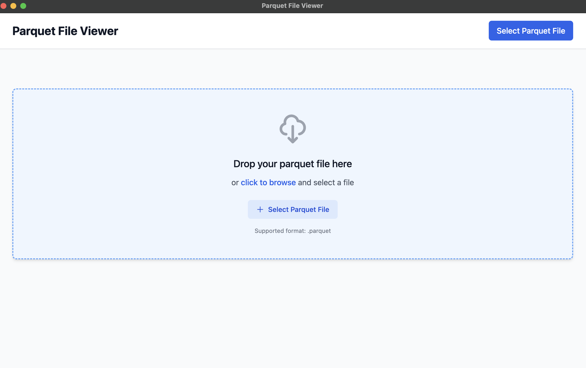

# Parquet File Viewer



A cross-platform desktop application for viewing and exploring parquet files with high performance and an intuitive interface.

## Features

- **Fast Parquet File Processing** - Powered by DuckDB WASM for efficient data loading
- **Cross-Platform** - Available for Windows, macOS, and Linux
- **Modern UI** - Built with Vue 3 and Tailwind CSS
- **Large File Support** - Handles large parquet files with pagination
- **Type-Aware Display** - Proper formatting for different data types
- **Responsive Design** - Adapts to different screen sizes

## Technology Stack

- **Frontend**: Vue 3 with Composition API
- **Styling**: Tailwind CSS  
- **Desktop Framework**: Electron
- **Data Processing**: DuckDB WASM
- **Build Tool**: Vite
- **Package Manager**: npm

## Installation

## Option 1
Download from release

## Option 2
Run the app locally

### Prerequisites

- Node.js
- npm

### Development Setup

1. Clone the repository:
```bash
git clone git@github.com:hyi9/parquet-file-viewer.git
cd parquet-file-viewer
```

2. Install dependencies:
```bash
npm install
```

3. Start the development server:
```bash
npm run dev
```

This will launch both the Vue development server and Electron app with hot reload enabled.

## Building for Production

### Build the application:
```bash
npm run build
```

### Create distributable packages:
```bash
npm run dist
```

This will create platform-specific distributables in the `dist` folder:
- **Windows**: NSIS installer
- **macOS**: Application bundle
- **Linux**: AppImage

## Usage

1. Launch the application
2. Click "Select Parquet File" to open a file dialog
3. Choose your parquet file
4. View the data in the interactive table
5. Use pagination controls for large files
6. Data types are automatically formatted for readability

## Architecture

### Directory Structure
```
src/
├── main/           # Electron main process
│   ├── main.js     # Main process entry point
│   └── preload.js  # Context bridge for IPC
└── renderer/       # Vue 3 renderer process
    ├── components/ # Vue components
    ├── utils/      # Utility functions (DuckDB integration)
    ├── App.vue     # Root component
    └── main.js     # Renderer entry point
```
### Key Components

- **Main Process**: Handles window creation, file dialogs, and file system operations
- **Renderer Process**: Vue 3 application with data visualization
- **DuckDB Integration**: Efficient parquet file processing in WASM
- **IPC Communication**: Secure bridge between main and renderer processes

## Development

### Available Scripts

- `npm run dev` - Start development with hot reload
- `npm run dev:vue` - Start only Vue development server
- `npm run dev:electron` - Start only Electron (requires Vue server)
- `npm run build` - Build for production
- `npm run dist` - Create distributable packages

### Development Guidelines

- Use Vue 3 Composition API for new components
- Follow Tailwind utility-first CSS approach
- Keep DuckDB operations in renderer process for performance
- Maintain secure IPC communication patterns

## Contributing

1. Fork the repository
2. Create a feature branch
3. Make your changes
4. Test thoroughly
5. Submit a pull request

## License

MIT License - see LICENSE file for details

## Author

@hyi9